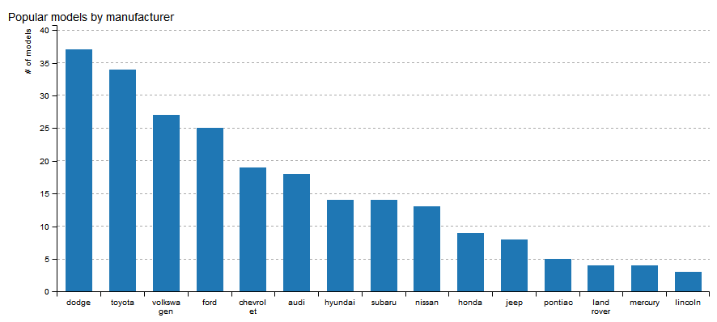

# billboarder


> Htmlwidget for billboard.js

[](https://travis-ci.org/dreamRs/billboarder)


:construction: :warning: **package under developpement !** :warning: :construction:


## Overview

This package allow you to use [billboard.js](https://naver.github.io/billboard.js/),
a re-usable easy interface JavaScript chart library, based on D3 v4+.

Note : developpement is heavily inspired by awesome [highcharter](http://jkunst.com/highcharter/) by [Joshua Kunst](https://github.com/jbkunst).


## Bar chart

For now, you can do barcharts !


```r
library(data.table)
data("mpg", package = "ggplot2")
setDT(mpg)
mpgagg <- mpg[, list(n = .N), by = manufacturer]
mpgagg

library(billboarder)
library(magrittr)
billboarder() %>%
  bb_bar(data = mpgagg[, list(manufacturer, n)]) %>%
  bb_axis(x = list(type = "category"), rotated = TRUE) %>%
  bb_title(text = "Number of models by manufacturer", position = "left-top")

```




