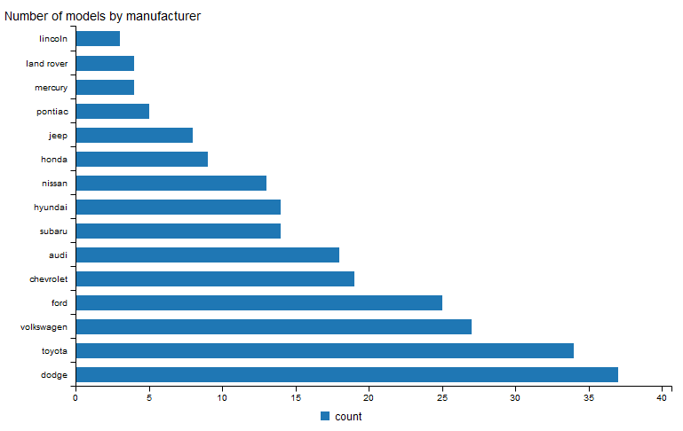
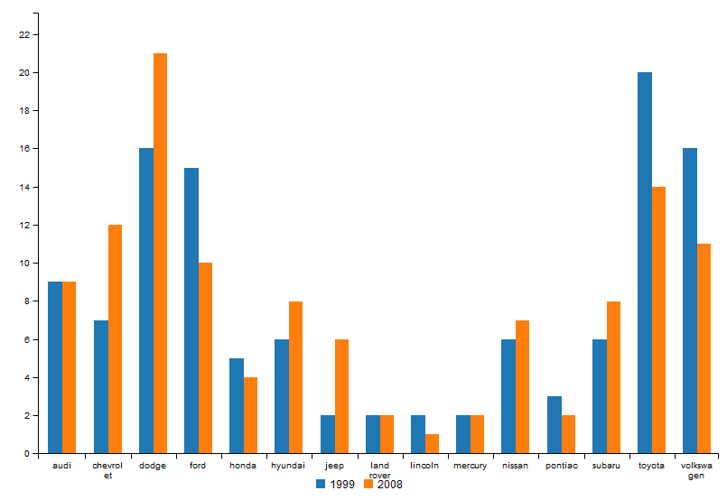
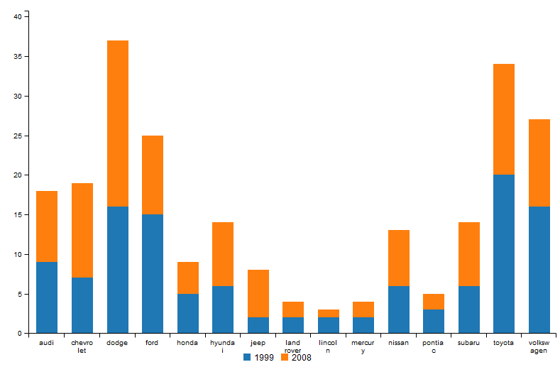
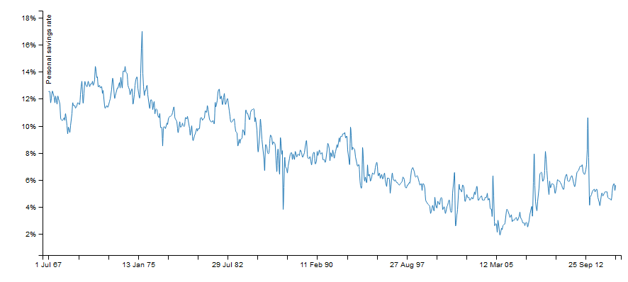

# billboarder


> Htmlwidget for billboard.js

[](https://travis-ci.org/dreamRs/billboarder)


:construction: :warning: **package under developpement !** :warning: :construction:


## Overview

This package allow you to use [billboard.js](https://naver.github.io/billboard.js/),
a re-usable easy interface JavaScript chart library, based on D3 v4+.

Note : developpement is heavily inspired by awesome [highcharter](http://jkunst.com/highcharter/) by [Joshua Kunst](https://github.com/jbkunst).


Installation :
```r
# From Github
# install.packages("devtools")
devtools::install_github("dreamRs/billboarder")
```


## Bar chart

For now, you can do barcharts !


```r
library("billboarder")
library("magrittr")
library("data.table")

# data
data("mpg", package = "ggplot2")
setDT(mpg)

# simple bar chart
billboarder() %>%
  bb_bar(data = mpg[, list(count = .N), by = manufacturer][order(count)]) %>%
  bb_axis(rotated = TRUE) %>%
  bb_title(text = "Number of models by manufacturer", position = "left-top")

```




Or with `dplyr` :

```r
library("dplyr")

mpg %>% 
  count(manufacturer) %>% 
  arrange(n) %>% 
  billboarder(data = .) %>% 
  bb_bar() %>%
  bb_axis(rotated = TRUE) %>%
  bb_title(text = "Number of models by manufacturer", position = "left-top")
```


### Dodge and stacked bar charts

You have to reshape the data in a "wide" format :

```r
billboarder() %>%
  bb_bar(
    data = dcast(
      data = mpg[, list(count = .N), by = list(manufacturer, year)],
      formula = manufacturer~year,
      value.var = "count"
    )
  )

```




With `dplyr` and `tidyr` :

```r
mpg %>% 
  group_by(manufacturer, year) %>% 
  summarise(n = n()) %>% 
  spread(year, n) %>% 
  billboarder(data = .) %>%
  bb_bar(stacked = TRUE)

```




## Raw API

In fact you can do whatever you want, you just have to pass a list-JSON as parameter :


```r
data(economics, package = "ggplot2")

# Construct a list in JSON format
params <- list(
  data = list(
    x = "x",
    json = list(
      x = economics$date,
      y = economics$psavert
    ),
    type = "spline"
  ),
  legend = list(show = FALSE),
  point = list(show = FALSE),
  axis = list(
    x = list(
      type = "timeseries",
      tick = list(
        count = 20,
        fit = TRUE,
        format = "%e %b %y"
      )
    ),
    y = list(
      label = list(
        text = "Personal savings rate"
      ),
      tick = list(
        format = htmlwidgets::JS("function(x) {return x + '%';}")
      )
    )
  )
)

# Pass the list as parameter
billboarder(params)
```



