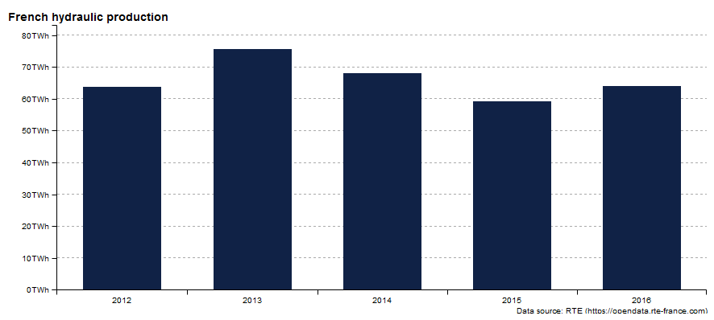
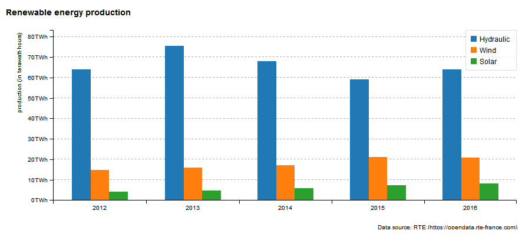
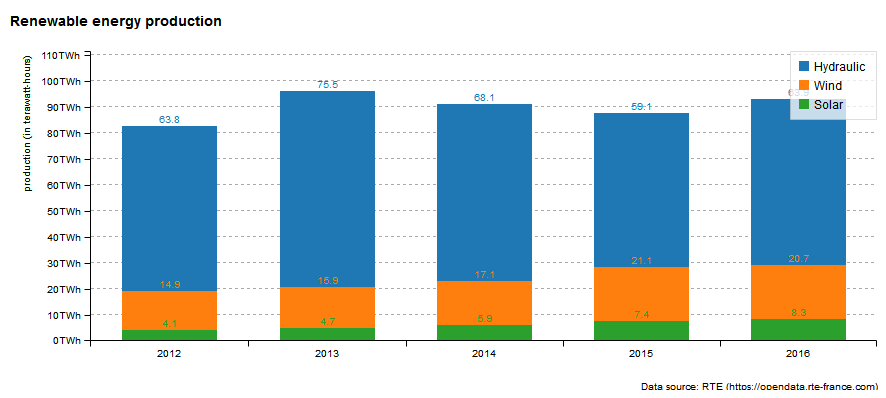
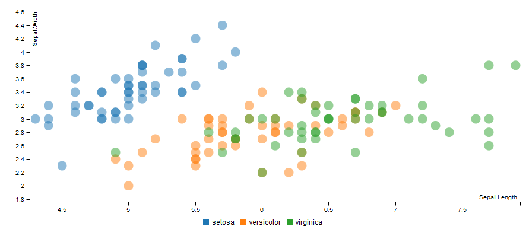
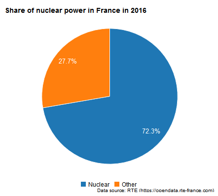
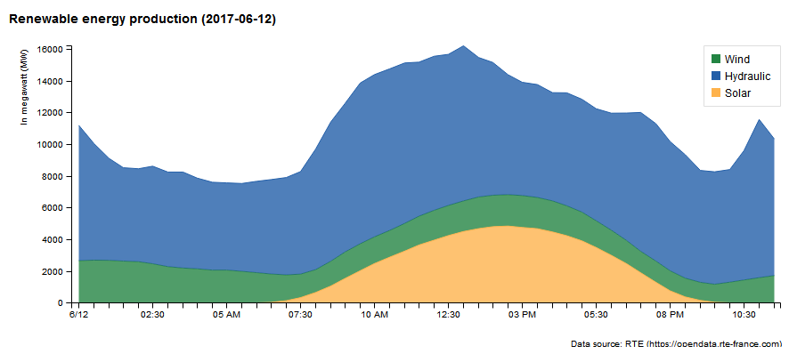
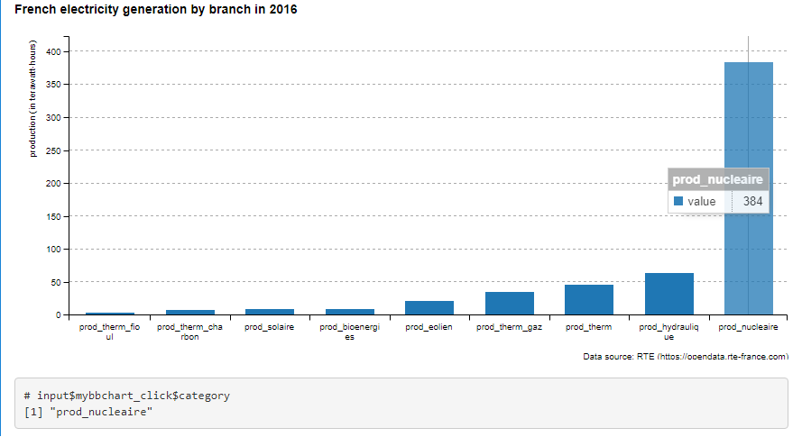

# billboarder


> Htmlwidget for billboard.js

[](https://travis-ci.org/dreamRs/billboarder)


## Overview

This package allow you to use [billboard.js](https://naver.github.io/billboard.js/),
a re-usable easy interface JavaScript chart library, based on D3 v4+.

A **proxy** method is implemented to smoothly update charts in shiny applications, see below for details.

Note : developpement is heavily inspired by awesome [highcharter](http://jkunst.com/highcharter/) by [Joshua Kunst](https://github.com/jbkunst).


Installation :
```r
# From Github
# install.packages("devtools")
devtools::install_github("dreamRs/billboarder")
```

A markdown document with some examples is available here : http://rpubs.com/Victorp/billboarder_examples


## Bar chart

You can do barcharts !


```r
library("billboarder")

# data
data("prod_par_filiere")

# a bar chart !
billboarder() %>%
  bb_barchart(data = prod_par_filiere[, c("annee", "prod_hydraulique")], color = "#102246") %>%
  bb_y_grid(show = TRUE) %>%
  bb_y_axis(tick = list(format = suffix("TWh")),
            label = list(text = "production (in terawatt-hours)", position = "outer-top")) %>% 
  bb_legend(show = FALSE) %>% 
  bb_labs(title = "French hydraulic production",
          caption = "Data source: RTE (https://opendata.rte-france.com)")
```




And dodge bar chart too !

```r
library("billboarder")

# data
data("prod_par_filiere")

# dodge bar chart !
billboarder() %>%
  bb_barchart(
    data = prod_par_filiere[, c("annee", "prod_hydraulique", "prod_eolien", "prod_solaire")]
  ) %>%
  bb_data(
    names = list(prod_hydraulique = "Hydraulic", prod_eolien = "Wind", prod_solaire = "Solar")
  ) %>% 
  bb_y_grid(show = TRUE) %>%
  bb_y_axis(tick = list(format = suffix("TWh")),
            label = list(text = "production (in terawatt-hours)", position = "outer-top")) %>% 
  bb_legend(position = "inset", inset = list(anchor = "top-right")) %>% 
  bb_labs(title = "Renewable energy production",
          caption = "Data source: RTE (https://opendata.rte-france.com)")
```




Even stacked bar charts !

```r
library("billboarder")

# data
data("prod_par_filiere")

# stacked bar chart !
billboarder() %>%
  bb_barchart(
    data = prod_par_filiere[, c("annee", "prod_hydraulique", "prod_eolien", "prod_solaire")], 
    stacked = TRUE
  ) %>%
  bb_data(
    names = list(prod_hydraulique = "Hydraulic", prod_eolien = "Wind", prod_solaire = "Solar"), 
    labels = TRUE
  ) %>% 
  bb_colors_manual(
    "prod_eolien" = "#41AB5D", "prod_hydraulique" = "#4292C6", "prod_solaire" = "#FEB24C"
  ) %>%
  bb_y_grid(show = TRUE) %>%
  bb_y_axis(tick = list(format = suffix("TWh")),
            label = list(text = "production (in terawatt-hours)", position = "outer-top")) %>% 
  bb_legend(position = "right") %>% 
  bb_labs(title = "Renewable energy production",
          caption = "Data source: RTE (https://opendata.rte-france.com)")
```




## Scatter plot

Classic :

```r
billboarder() %>% 
 bb_scatterplot(data = iris, x = "Sepal.Length", y = "Sepal.Width", group = "Species") %>% 
 bb_axis(x = list(tick = list(fit = FALSE))) %>% 
 bb_point(r = 8)

```



## Pie charts

If you have to, you can do pie charts !

```r
library("billboarder")

# data
data("prod_par_filiere")
nuclear2016 <- data.frame(
  sources = c("Nuclear", "Other"),
  production = c(
    prod_par_filiere$prod_nucleaire[prod_par_filiere$annee == "2016"],
    prod_par_filiere$prod_total[prod_par_filiere$annee == "2016"] -
      prod_par_filiere$prod_nucleaire[prod_par_filiere$annee == "2016"]
  )
)

# pie chart !
billboarder() %>% 
  bb_piechart(data = nuclear2016) %>% 
  bb_labs(title = "Share of nuclear power in France in 2016",
          caption = "Data source: RTE (https://opendata.rte-france.com)")
```




You can also do donut charts.


## Lines charts

A time serie with `Date` ! (subchart is optionnal)

```r
library("billboarder")

# data
data("equilibre_mensuel")

# line chart
billboarder() %>% 
  bb_linechart(
    data = equilibre_mensuel[, c("date", "consommation", "production")], 
    type = "spline"
  ) %>% 
  bb_x_axis(tick = list(format = "%Y-%m", fit = FALSE)) %>% 
  bb_x_grid(show = TRUE) %>% 
  bb_y_grid(show = TRUE) %>% 
  bb_colors_manual("consommation" = "firebrick", "production" = "forestgreen") %>% 
  bb_legend(position = "right") %>% 
  bb_subchart(show = TRUE, size = list(height = 30)) %>% 
  bb_labs(title = "Monthly electricity consumption and production in France (2007 - 2017)",
          y = "In megawatt (MW)",
          caption = "Data source: RTE (https://opendata.rte-france.com)")
```


A time serie with `POSIXct` ! (and regions)

```r
library("billboarder")

# data
data("cdc_prod_filiere")

# Retrieve sunrise and and sunset data with `suncalc`
library("suncalc")
sun <- getSunlightTimes(date = as.Date("2017-06-12"), lat = 48.86, lon = 2.34, tz = "CET")


# line chart
billboarder() %>% 
  bb_linechart(data = cdc_prod_filiere[, c("date_heure", "prod_solaire")]) %>% 
  bb_x_axis(tick = list(format = "%H:%M", fit = FALSE)) %>% 
  bb_y_axis(min = 0, padding = 0) %>% 
  bb_regions(
    list(
      start = as.numeric(cdc_prod_filiere$date_heure[1]) * 1000,
      end = as.numeric(sun$sunrise)*1000
    ), 
    list(
      start = as.numeric(sun$sunset) * 1000, 
      end = as.numeric(cdc_prod_filiere$date_heure[48]) * 1000
    )
  ) %>% 
  bb_x_grid(
    lines = list(
      list(value = as.numeric(sun$sunrise)*1000, text = "sunrise"),
      list(value = as.numeric(sun$sunset)*1000, text = "sunset")
    )
  ) %>% 
  bb_labs(title = "Solar production (2017-06-12)",
          y = "In megawatt (MW)",
          caption = "Data source: RTE (https://opendata.rte-france.com)")
```


A stacked area chart !

```r
library("billboarder")

# data
data("cdc_prod_filiere")

# area chart !
billboarder() %>% 
  bb_linechart(
    data = cdc_prod_filiere[, c("date_heure", "prod_eolien", "prod_hydraulique", "prod_solaire")], 
    type = "area"
  ) %>% 
  bb_data(
    groups = list(list("prod_eolien", "prod_hydraulique", "prod_solaire")),
    names = list("prod_eolien" = "Wind", "prod_hydraulique" = "Hydraulic", "prod_solaire" = "Solar")
  ) %>% 
  bb_legend(position = "inset", inset = list(anchor = "top-right")) %>% 
  bb_colors_manual(
    "prod_eolien" = "#238443", "prod_hydraulique" = "#225EA8", "prod_solaire" = "#FEB24C", 
    opacity = 0.8
  ) %>% 
  bb_y_axis(min = 0, padding = 0) %>% 
  bb_labs(title = "Renewable energy production (2017-06-12)",
          y = "In megawatt (MW)",
          caption = "Data source: RTE (https://opendata.rte-france.com)")
```




You can also do step lines.


## Shiny interaction

Some events will trigger Shiny's inputs in application, such as click. Inputs id associated with `billboarder` charts use this pattern :

```r
input$CHARTID_EVENT
```

Look at this example, chart id is `mybbchart` so you retrieve click with `input$mybbchart_click` :

```r
library("shiny")
library("billboarder")

# data
data("prod_par_filiere")
prod_par_filiere_l <- reshape2::melt(data = prod_par_filiere)
prod_par_filiere_l <- prod_par_filiere_l[
  with(prod_par_filiere_l, annee == "2016" & variable != "prod_total"), 2:3
]
prod_par_filiere_l <- prod_par_filiere_l[order(prod_par_filiere_l$value), ]


# app
ui <- fluidPage(
  billboarderOutput(outputId = "mybbchart"),
  br(),
  verbatimTextOutput(outputId = "click")
)

server <- function(input, output, session) {
  
  output$mybbchart <- renderBillboarder({
    billboarder() %>%
      bb_barchart(data = prod_par_filiere_l) %>% 
      bb_y_grid(show = TRUE) %>% 
      bb_legend(show = FALSE) %>%
      bb_x_axis(categories = prod_par_filiere_l$variable, fit = FALSE) %>% 
      bb_labs(title = "French electricity generation by branch in 2016",
              y = "production (in terawatt-hours)",
              caption = "Data source: RTE (https://opendata.rte-france.com)")
  })
  
  output$click <- renderPrint({
    cat("# input$mybbchart_click$category", "\n")
    input$mybbchart_click$category
  })
  
}

shinyApp(ui = ui, server = server)
```




## Proxy

You can modify existing charts with function `billboarderProxy` :


To see examples, run : 

```r
library("billboarder")
proxy_example("bar")
proxy_example("line")
proxy_example("pie")
proxy_example("gauge")
```


## Combination charts

For now, you have to specify the type of chart according to the data, this might change in the future :

```r
# from ?plot
# require(stats); plot(cars); lines(lowess(cars))
billboarder() %>% 
  bb_scatterplot(data = cars) %>% 
  bb_linechart(data = data.frame(lowess(cars)), x = "x") %>% 
  bb_data(types = list(dist = "scatter", y = "line"))

```


## Raw API

If what you want to do is not possible with higher function in the package, you can anyway do what you want, you just have to pass a list-JSON as parameter :


```r
data(economics, package = "ggplot2")

# Construct a list in JSON format
params <- list(
  data = list(
    x = "x",
    json = list(
      x = economics$date,
      y = economics$psavert
    ),
    type = "spline"
  ),
  legend = list(show = FALSE),
  point = list(show = FALSE),
  axis = list(
    x = list(
      type = "timeseries",
      tick = list(
        count = 20,
        fit = TRUE,
        format = "%e %b %y"
      )
    ),
    y = list(
      label = list(
        text = "Personal savings rate"
      ),
      tick = list(
        format = htmlwidgets::JS("function(x) {return x + '%';}")
      )
    )
  )
)

# Pass the list as parameter
billboarder(params)
```


