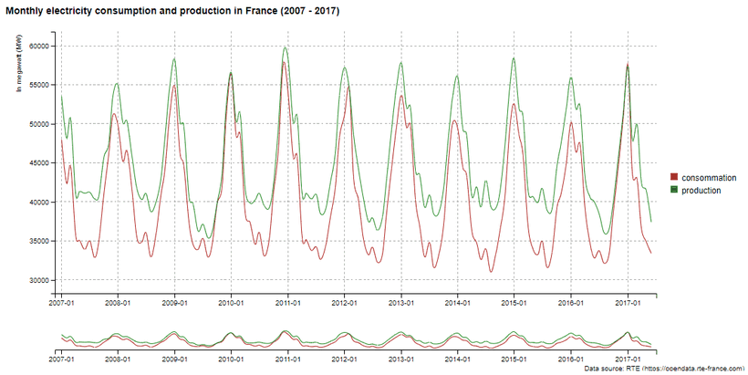

# billboarder

> Htmlwidget for [billboard.js](https://github.com/naver/billboard.js)

<!-- badges: start -->
[](https://CRAN.R-project.org/package=billboarder)
[](https://CRAN.R-project.org/package=billboarder)
[](https://app.codecov.io/gh/dreamRs/billboarder?branch=master)
[](https://github.com/dreamRs/billboarder/actions/workflows/R-CMD-check.yaml)
<!-- badges: end -->


## Overview

This package allow you to use [billboard.js](https://naver.github.io/billboard.js/), a re-usable easy interface JavaScript chart library, based on D3 v4+.

A **proxy** method is implemented to smoothly update charts in shiny applications, see below for details.


## Installation :

Install from [CRAN](https://CRAN.R-project.org/package=billboarder) with:
```r
install.packages("billboarder")
```

Install development version grom [GitHub](https://github.com/dreamRs/billboarder) with:
```r
# install.packages("remotes")
remotes::install_github("dreamRs/billboarder")
```

For interactive examples & documentation, see `pkgdown` site : https://dreamrs.github.io/billboarder/index.html


## Bar / column charts

Simple bar chart :

```r
library("billboarder")

# data
data("prod_par_filiere")

# a bar chart !
billboarder() %>%
  bb_barchart(data = prod_par_filiere[, c("annee", "prod_hydraulique")], color = "#102246") %>%
  bb_y_grid(show = TRUE) %>%
  bb_y_axis(tick = list(format = suffix("TWh")),
            label = list(text = "production (in terawatt-hours)", position = "outer-top")) %>% 
  bb_legend(show = FALSE) %>% 
  bb_labs(title = "French hydraulic production",
          caption = "Data source: RTE (https://opendata.rte-france.com)")
```


Multiple categories bar chart :

```r
library("billboarder")

# data
data("prod_par_filiere")

# dodge bar chart !
billboarder() %>%
  bb_barchart(
    data = prod_par_filiere[, c("annee", "prod_hydraulique", "prod_eolien", "prod_solaire")]
  ) %>%
  bb_data(
    names = list(prod_hydraulique = "Hydraulic", prod_eolien = "Wind", prod_solaire = "Solar")
  ) %>% 
  bb_y_grid(show = TRUE) %>%
  bb_y_axis(tick = list(format = suffix("TWh")),
            label = list(text = "production (in terawatt-hours)", position = "outer-top")) %>% 
  bb_legend(position = "inset", inset = list(anchor = "top-right")) %>% 
  bb_labs(title = "Renewable energy production",
          caption = "Data source: RTE (https://opendata.rte-france.com)")
```


Stacked bar charts :

```r
library("billboarder")

# data
data("prod_par_filiere")

# stacked bar chart !
billboarder() %>%
  bb_barchart(
    data = prod_par_filiere[, c("annee", "prod_hydraulique", "prod_eolien", "prod_solaire")], 
    stacked = TRUE
  ) %>%
  bb_data(
    names = list(prod_hydraulique = "Hydraulic", prod_eolien = "Wind", prod_solaire = "Solar"), 
    labels = TRUE
  ) %>% 
  bb_colors_manual(
    "prod_eolien" = "#41AB5D", "prod_hydraulique" = "#4292C6", "prod_solaire" = "#FEB24C"
  ) %>%
  bb_y_grid(show = TRUE) %>%
  bb_y_axis(tick = list(format = suffix("TWh")),
            label = list(text = "production (in terawatt-hours)", position = "outer-top")) %>% 
  bb_legend(position = "right") %>% 
  bb_labs(title = "Renewable energy production",
          caption = "Data source: RTE (https://opendata.rte-france.com)")
```


## Scatter plot

Classic :

```r
library(billboarder)
library(palmerpenguins)
billboarder() %>% 
  bb_scatterplot(data = penguins, x = "bill_length_mm", y = "flipper_length_mm", group = "species") %>% 
  bb_axis(x = list(tick = list(fit = FALSE))) %>% 
  bb_point(r = 8)

```


You can make a bubble chart using `size` aes : 

```r
billboarder() %>% 
  bb_scatterplot(
    data = penguins, 
    mapping = bbaes(
      bill_length_mm, flipper_length_mm, group = species,
      size = scales::rescale(body_mass_g, c(1, 100))
    )
  ) %>% 
  bb_bubble(maxR = 25) %>% 
  bb_x_axis(tick = list(fit = FALSE))
```


## Pie / Donut charts

```r
library("billboarder")

# data
data("prod_par_filiere")
nuclear2016 <- data.frame(
  sources = c("Nuclear", "Other"),
  production = c(
    prod_par_filiere$prod_nucleaire[prod_par_filiere$annee == "2016"],
    prod_par_filiere$prod_total[prod_par_filiere$annee == "2016"] -
      prod_par_filiere$prod_nucleaire[prod_par_filiere$annee == "2016"]
  )
)

# pie chart !
billboarder() %>% 
  bb_piechart(data = nuclear2016) %>% 
  bb_labs(title = "Share of nuclear power in France in 2016",
          caption = "Data source: RTE (https://opendata.rte-france.com)")
```


## Lines charts

### Time serie with `Date` (and a subchart)

```r
library("billboarder")

# data
data("equilibre_mensuel")

# line chart
billboarder() %>% 
  bb_linechart(
    data = equilibre_mensuel[, c("date", "consommation", "production")], 
    type = "spline"
  ) %>% 
  bb_x_axis(tick = list(format = "%Y-%m", fit = FALSE)) %>% 
  bb_x_grid(show = TRUE) %>% 
  bb_y_grid(show = TRUE) %>% 
  bb_colors_manual("consommation" = "firebrick", "production" = "forestgreen") %>% 
  bb_legend(position = "right") %>% 
  bb_subchart(show = TRUE, size = list(height = 30)) %>% 
  bb_labs(title = "Monthly electricity consumption and production in France (2007 - 2017)",
          y = "In megawatt (MW)",
          caption = "Data source: RTE (https://opendata.rte-france.com)")
```




### Zoom by dragging

```r
billboarder() %>% 
  bb_linechart(
    data = equilibre_mensuel[, c("date", "consommation", "production")], 
    type = "spline"
  ) %>% 
  bb_x_axis(tick = list(format = "%Y-%m", fit = FALSE)) %>% 
  bb_x_grid(show = TRUE) %>% 
  bb_y_grid(show = TRUE) %>% 
  bb_colors_manual("consommation" = "firebrick", "production" = "forestgreen") %>% 
  bb_legend(position = "right") %>% 
  bb_zoom(
    enabled = TRUE,
    type = "drag",
    resetButton = list(text = "Unzoom")
  ) %>% 
  bb_labs(title = "Monthly electricity consumption and production in France (2007 - 2017)",
          y = "In megawatt (MW)",
          caption = "Data source: RTE (https://opendata.rte-france.com)")
```


### Time serie with `POSIXct` (and regions)

```r
library("billboarder")

# data
data("cdc_prod_filiere")

# Retrieve sunrise and and sunset data with `suncalc`
library("suncalc")
sun <- getSunlightTimes(date = as.Date("2017-06-12"), lat = 48.86, lon = 2.34, tz = "CET")


# line chart
billboarder() %>% 
  bb_linechart(data = cdc_prod_filiere[, c("date_heure", "prod_solaire")]) %>% 
  bb_x_axis(tick = list(format = "%H:%M", fit = FALSE)) %>% 
  bb_y_axis(min = 0, padding = 0) %>% 
  bb_regions(
    list(
      start = as.numeric(cdc_prod_filiere$date_heure[1]) * 1000,
      end = as.numeric(sun$sunrise)*1000
    ), 
    list(
      start = as.numeric(sun$sunset) * 1000, 
      end = as.numeric(cdc_prod_filiere$date_heure[48]) * 1000
    )
  ) %>% 
  bb_x_grid(
    lines = list(
      list(value = as.numeric(sun$sunrise)*1000, text = "sunrise"),
      list(value = as.numeric(sun$sunset)*1000, text = "sunset")
    )
  ) %>% 
  bb_labs(title = "Solar production (2017-06-12)",
          y = "In megawatt (MW)",
          caption = "Data source: RTE (https://opendata.rte-france.com)")
```


### Stacked area chart

```r
library("billboarder")

# data
data("cdc_prod_filiere")

# area chart !
billboarder() %>% 
  bb_linechart(
    data = cdc_prod_filiere[, c("date_heure", "prod_eolien", "prod_hydraulique", "prod_solaire")], 
    type = "area"
  ) %>% 
  bb_data(
    groups = list(list("prod_eolien", "prod_hydraulique", "prod_solaire")),
    names = list("prod_eolien" = "Wind", "prod_hydraulique" = "Hydraulic", "prod_solaire" = "Solar")
  ) %>% 
  bb_legend(position = "inset", inset = list(anchor = "top-right")) %>% 
  bb_colors_manual(
    "prod_eolien" = "#238443", "prod_hydraulique" = "#225EA8", "prod_solaire" = "#FEB24C", 
    opacity = 0.8
  ) %>% 
  bb_y_axis(min = 0, padding = 0) %>% 
  bb_labs(title = "Renewable energy production (2017-06-12)",
          y = "In megawatt (MW)",
          caption = "Data source: RTE (https://opendata.rte-france.com)")
```


### Line range

```r
# Generate data
dat <- data.frame(
  date = seq.Date(Sys.Date(), length.out = 20, by = "day"),
  y1 = round(rnorm(20, 100, 15)),
  y2 = round(rnorm(20, 100, 15))
)
dat$ymin1 <- dat$y1 - 5
dat$ymax1 <- dat$y1 + 5

dat$ymin2 <- dat$y2 - sample(3:15, 20, TRUE)
dat$ymax2 <- dat$y2 + sample(3:15, 20, TRUE)


# Make chart : use ymin & ymax aes for range
billboarder(data = dat) %>% 
  bb_linechart(
    mapping = bbaes(x = date, y = y1, ymin = ymin1, ymax = ymax1),
    type = "area-line-range"
  ) %>% 
  bb_linechart(
    mapping = bbaes(x = date, y = y2, ymin = ymin2, ymax = ymax2), 
    type = "area-spline-range"
  ) %>% 
  bb_y_axis(min = 50)
```


## Histogram & density

```r
billboarder() %>%
  bb_histogram(data = rnorm(1e5), binwidth = 0.25) %>%
  bb_colors_manual()
```


With a grouping variable :

```r
# Generate some data
dat <- data.frame(
  sample = c(rnorm(n = 1e4, mean = 1), rnorm(n = 1e4, mean = 2)),
  group = rep(c("A", "B"), each = 1e4), stringsAsFactors = FALSE
)
# Mean by groups
samples_mean <- tapply(dat$sample, dat$group, mean)
# histogram !
billboarder() %>%
  bb_histogram(data = dat, x = "sample", group = "group", binwidth = 0.25) %>%
  bb_x_grid(
    lines = list(
      list(value = unname(samples_mean['A']), text = "mean of sample A"),
      list(value = unname(samples_mean['B']), text = "mean of sample B")
    )
  )
```


Density plot with the same data :

```r
billboarder() %>%
  bb_densityplot(data = dat, x = "sample", group = "group") %>%
  bb_x_grid(
    lines = list(
      list(value = unname(samples_mean['A']), text = "mean of sample A"),
      list(value = unname(samples_mean['B']), text = "mean of sample B")
    )
  )
```


## Shiny interaction

Some events will trigger Shiny's inputs in application, such as click. Inputs id associated with `billboarder` charts use this pattern :

```r
input$CHARTID_EVENT
```

Look at this example, chart id is `mybbchart` so you retrieve click with `input$mybbchart_click` :

```r
library("shiny")
library("billboarder")

# data
data("prod_par_filiere")
prod_par_filiere_l <- reshape2::melt(data = prod_par_filiere)
prod_par_filiere_l <- prod_par_filiere_l[
  with(prod_par_filiere_l, annee == "2016" & variable != "prod_total"), 2:3
]
prod_par_filiere_l <- prod_par_filiere_l[order(prod_par_filiere_l$value), ]


# app
ui <- fluidPage(
  billboarderOutput(outputId = "mybbchart"),
  br(),
  verbatimTextOutput(outputId = "click")
)

server <- function(input, output, session) {
  
  output$mybbchart <- renderBillboarder({
    billboarder() %>%
      bb_barchart(data = prod_par_filiere_l) %>% 
      bb_y_grid(show = TRUE) %>% 
      bb_legend(show = FALSE) %>%
      bb_x_axis(categories = prod_par_filiere_l$variable, fit = FALSE) %>% 
      bb_labs(title = "French electricity generation by branch in 2016",
              y = "production (in terawatt-hours)",
              caption = "Data source: RTE (https://opendata.rte-france.com)")
  })
  
  output$click <- renderPrint({
    cat("# input$mybbchart_click$category", "\n")
    input$mybbchart_click$category
  })
  
}

shinyApp(ui = ui, server = server)
```


## Proxy

You can modify existing charts with function `billboarderProxy` :


To see examples, run : 

```r
library("billboarder")
proxy_example("bar")
proxy_example("line")
proxy_example("pie")
proxy_example("gauge")
```


## Raw API

If you wish, you can build graphs using a `list` syntax :

```r
data(economics, package = "ggplot2")

# Construct a list in JSON format
params <- list(
  data = list(
    x = "x",
    json = list(
      x = economics$date,
      y = economics$psavert
    ),
    type = "spline"
  ),
  legend = list(show = FALSE),
  point = list(show = FALSE),
  axis = list(
    x = list(
      type = "timeseries",
      tick = list(
        count = 20,
        fit = TRUE,
        format = "%e %b %y"
      )
    ),
    y = list(
      label = list(
        text = "Personal savings rate"
      ),
      tick = list(
        format = htmlwidgets::JS("function(x) {return x + '%';}")
      )
    )
  )
)

# Pass the list as parameter
billboarder(params)
```


